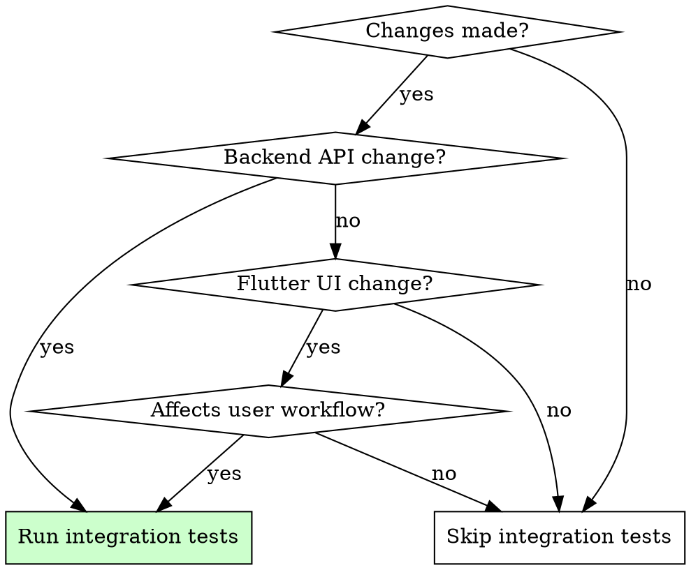

# Flutter Integration Testing

## Overview

Run integration tests after backend or Flutter changes to validate complete app workflows.

**Core principle:** Integration tests verify how pieces work together on real devices - unit tests and widget tests are not enough for end-to-end validation.

## When to Use



**Always run integration tests after:**
- Backend API changes (new endpoints, modified responses)
- Flutter screen changes affecting navigation
- Form submission flows modified
- Authentication/authorization changes
- Data persistence changes

**Skip when:**
- Only style/cosmetic changes
- Unit-testable logic changes
- Documentation updates

## Setup

### Required Dependencies

```yaml
# pubspec.yaml
dev_dependencies:
  integration_test:
    sdk: flutter
  flutter_test:
    sdk: flutter
```

### Directory Structure

```
your_app/
  integration_test/
    app_test.dart           # Main integration tests
    flows/
      auth_flow_test.dart   # Authentication flow tests
      recipe_flow_test.dart # Feature-specific flow tests
  test_driver/
    integration_test.dart   # Driver for running tests
```

## Writing Integration Tests

### Basic Test Structure

```dart
import 'package:flutter/material.dart';
import 'package:flutter_test/flutter_test.dart';
import 'package:integration_test/integration_test.dart';
import 'package:your_app/main.dart' as app;

void main() {
  IntegrationTestWidgetsFlutterBinding.ensureInitialized();

  group('Feature Flow', () {
    testWidgets('complete user workflow', (tester) async {
      app.main();
      await tester.pumpAndSettle();

      // Find and interact with widgets
      final button = find.byKey(const Key('submit_button'));
      expect(button, findsOneWidget);

      await tester.tap(button);
      await tester.pumpAndSettle();

      // Verify expected outcome
      expect(find.text('Success'), findsOneWidget);
    });
  });
}
```

### Testing API Interactions

```dart
testWidgets('fetches and displays data from API', (tester) async {
  app.main();
  await tester.pumpAndSettle();

  // Trigger data fetch
  await tester.tap(find.byKey(const Key('refresh_button')));
  await tester.pumpAndSettle(const Duration(seconds: 5));

  // Verify data displayed
  expect(find.byType(ListTile), findsWidgets);
});
```

### Testing Navigation Flows

```dart
testWidgets('navigates through multi-screen flow', (tester) async {
  app.main();
  await tester.pumpAndSettle();

  // Screen 1: Select items
  await tester.tap(find.text('Item 1'));
  await tester.tap(find.byKey(const Key('next_button')));
  await tester.pumpAndSettle();

  // Screen 2: Verify navigation
  expect(find.text('Screen 2 Title'), findsOneWidget);

  // Continue flow...
  await tester.tap(find.byKey(const Key('confirm_button')));
  await tester.pumpAndSettle();

  // Final screen: Verify completion
  expect(find.text('Complete'), findsOneWidget);
});
```

## Running Tests

### Command Line

```bash
# Run all integration tests
flutter test integration_test

# Run specific test file
flutter test integration_test/flows/auth_flow_test.dart

# Run on specific device
flutter test integration_test -d <device_id>
```

### Using MCP Dart Tools

```dart
// Use mcp__dart__run_tests for agent-friendly output
mcp__dart__run_tests with roots containing integration_test path
```

## Quick Reference

| Action | Code |
|--------|------|
| Wait for animations | `await tester.pumpAndSettle()` |
| Wait with timeout | `await tester.pumpAndSettle(Duration(seconds: 5))` |
| Find by Key | `find.byKey(const Key('my_key'))` |
| Find by text | `find.text('Button Text')` |
| Find by type | `find.byType(ElevatedButton)` |
| Tap widget | `await tester.tap(finder)` |
| Enter text | `await tester.enterText(finder, 'text')` |
| Scroll | `await tester.drag(finder, Offset(0, -300))` |
| Scroll until visible | `await tester.scrollUntilVisible(finder, 500)` |

## Common Mistakes

| Mistake | Fix |
|---------|-----|
| Not waiting for async | Always use `pumpAndSettle()` after actions |
| Hardcoded timeouts | Use `pumpAndSettle(Duration(...))` instead of `Future.delayed` |
| Missing widget keys | Add `Key('unique_key')` to widgets you need to find |
| Testing on debug build | Use `flutter test` which runs in debug, but profile for performance |
| Not handling loading states | Wait for loading indicators to disappear |

## Post-Change Checklist

After backend or Flutter changes:

- [ ] Identify affected user workflows
- [ ] Write/update integration tests for affected flows
- [ ] Run `flutter test integration_test`
- [ ] All tests pass
- [ ] No flaky tests (run 3 times if uncertain)
- [ ] Consider adding performance profiling (see flutter-performance-profiling skill)

## Red Flags - Write More Tests

- New API endpoint added without integration test
- Screen navigation changed without flow test
- Form submission modified without end-to-end test
- Authentication flow touched without auth test
- "It works in the simulator" without automated verification
