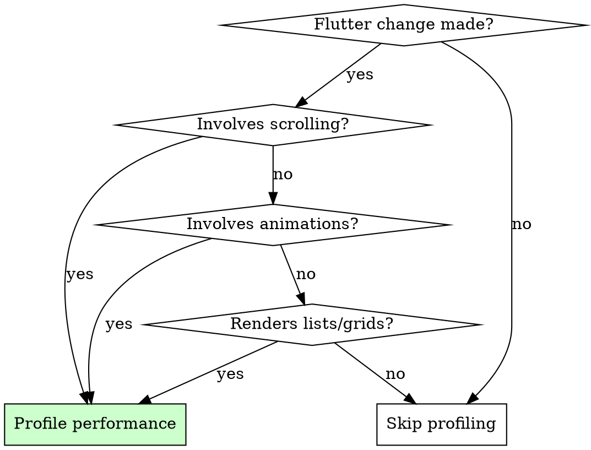

# Flutter Performance Profiling

## Overview

Profile Flutter app performance after UI changes to catch jank before users experience it.

**Core principle:** A frame taking >16.67ms causes visible stuttering at 60fps. Catch it in profiling, not production.

**Auto-trigger:** Run this after ANY Flutter change involving scrolling, animations, or list rendering.

## When to Use



**Always profile after:**
- Adding/modifying scrollable lists
- Implementing animations or transitions
- Adding complex widgets to build methods
- Modifying ListView, GridView, or CustomScrollView
- Image loading changes
- State management changes affecting rebuild frequency

**Note:** Performance profiling NOT supported on web. Use browser DevTools instead.

## Setup

### 1. Create Performance Test

Create `integration_test/performance_test.dart`:

```dart
import 'package:flutter/material.dart';
import 'package:flutter_test/flutter_test.dart';
import 'package:integration_test/integration_test.dart';
import 'package:your_app/main.dart' as app;

void main() {
  final binding = IntegrationTestWidgetsFlutterBinding.ensureInitialized();

  testWidgets('scrolling performance', (tester) async {
    app.main();
    await tester.pumpAndSettle();

    final listFinder = find.byType(Scrollable);

    // Profile the scrolling action
    await binding.traceAction(
      () async {
        await tester.fling(listFinder, const Offset(0, -500), 10000);
        await tester.pumpAndSettle();

        await tester.fling(listFinder, const Offset(0, 500), 10000);
        await tester.pumpAndSettle();
      },
      reportKey: 'scrolling_timeline',
    );
  });
}
```

### 2. Create Performance Driver

Create `test_driver/perf_driver.dart`:

```dart
import 'package:flutter_driver/flutter_driver.dart' as driver;
import 'package:integration_test/integration_test_driver.dart';

Future<void> main() {
  return integrationDriver(
    responseDataCallback: (data) async {
      if (data != null) {
        final timeline = driver.Timeline.fromJson(
          data['scrolling_timeline'] as Map<String, dynamic>,
        );

        final summary = driver.TimelineSummary.summarize(timeline);

        await summary.writeTimelineToFile(
          'scrolling_timeline',
          pretty: true,
          includeSummary: true,
        );
      }
    },
  );
}
```

## Running Performance Tests

```bash
flutter drive \
  --driver=test_driver/perf_driver.dart \
  --target=integration_test/performance_test.dart \
  --profile
```

**Important flags:**
- `--profile`: Compiles in profile mode (closer to production)
- `--no-dds`: Use when running on mobile devices/emulators

## Analyzing Results

### Output Files

Two files generated in build directory:

1. **scrolling_summary.timeline_summary.json** - Key metrics
2. **scrolling_timeline.timeline.json** - Full timeline for Chrome DevTools

### Key Metrics to Check

```json
{
  "average_frame_build_time_millis": 4.25,
  "worst_frame_build_time_millis": 21.0,
  "missed_frame_build_budget_count": 2,
  "average_frame_rasterizer_time_millis": 5.51,
  "worst_frame_rasterizer_time_millis": 51.0,
  "missed_frame_rasterizer_budget_count": 10,
  "frame_count": 54
}
```

### Performance Thresholds

| Metric | Target | Action if exceeded |
|--------|--------|-------------------|
| average_frame_build_time_millis | < 8ms | Optimize build methods |
| worst_frame_build_time_millis | < 16.67ms | Find and fix expensive frames |
| missed_frame_build_budget_count | 0 | Investigate missed frames |
| average_frame_rasterizer_time_millis | < 8ms | Optimize painting |
| worst_frame_rasterizer_time_millis | < 16.67ms | Check for expensive paints |
| missed_frame_rasterizer_budget_count | 0 | Reduce visual complexity |

## Fixing Performance Issues

### High Frame Build Time

**Symptoms:** `worst_frame_build_time_millis` > 16.67ms

**Fixes:**
```dart
// BAD: Expensive computation in build
Widget build(BuildContext context) {
  final processed = expensiveComputation(data); // Blocks frame
  return ListView.builder(...);
}

// GOOD: Compute outside build, use const
class MyWidget extends StatelessWidget {
  final List<ProcessedItem> processedData; // Pre-computed

  const MyWidget({required this.processedData});

  @override
  Widget build(BuildContext context) {
    return ListView.builder(
      itemBuilder: (context, index) => const ItemWidget(), // const where possible
    );
  }
}
```

### High Rasterizer Time

**Symptoms:** `worst_frame_rasterizer_time_millis` > 16.67ms

**Fixes:**
```dart
// BAD: Complex clipping and shadows
Container(
  decoration: BoxDecoration(
    boxShadow: [BoxShadow(blurRadius: 20)],
    borderRadius: BorderRadius.circular(20),
  ),
  clipBehavior: Clip.antiAlias,
  child: complexWidget,
)

// GOOD: Simpler decorations, cache layers
RepaintBoundary(
  child: Container(
    decoration: BoxDecoration(
      boxShadow: [BoxShadow(blurRadius: 4)], // Smaller blur
      borderRadius: BorderRadius.circular(8),
    ),
    child: complexWidget,
  ),
)
```

### Missed Frame Budget

**Symptoms:** `missed_frame_build_budget_count` > 0

**Fixes:**
```dart
// BAD: Building entire list at once
ListView(
  children: items.map((item) => ExpensiveWidget(item)).toList(),
)

// GOOD: Lazy building with ListView.builder
ListView.builder(
  itemCount: items.length,
  itemBuilder: (context, index) => ExpensiveWidget(items[index]),
)

// BETTER: Add cacheExtent for smooth scrolling
ListView.builder(
  cacheExtent: 500, // Pre-build 500px above/below viewport
  itemCount: items.length,
  itemBuilder: (context, index) => ExpensiveWidget(items[index]),
)
```

### Excessive Rebuilds

**Symptoms:** High average build time across many frames

**Fixes:**
```dart
// BAD: Entire tree rebuilds on state change
class MyWidget extends StatefulWidget {
  @override
  Widget build(BuildContext context) {
    return Column(
      children: [
        ExpensiveWidget(),
        Text('Count: $count'), // This changes
      ],
    );
  }
}

// GOOD: Isolate changing parts
class MyWidget extends StatefulWidget {
  @override
  Widget build(BuildContext context) {
    return Column(
      children: [
        const ExpensiveWidget(), // const - never rebuilds
        CounterText(count: count), // Only this rebuilds
      ],
    );
  }
}
```

## Chrome DevTools Analysis

Open `scrolling_timeline.timeline.json` in `chrome://tracing` for detailed analysis:

1. Open Chrome, navigate to `chrome://tracing`
2. Click "Load" and select the timeline JSON
3. Look for:
   - Long frames (red bars)
   - GPU rasterization bottlenecks
   - Expensive paint operations

## Quick Reference

| Problem | Solution |
|---------|----------|
| Slow list scrolling | Use `ListView.builder`, add `cacheExtent` |
| Animation jank | Use `const` widgets, reduce shadow complexity |
| Image loading stutter | Use `cached_network_image`, precache images |
| Complex shadows | Reduce `blurRadius`, use `RepaintBoundary` |
| Frequent rebuilds | Use `const`, split widgets, use Selector/Consumer |

## Post-Flutter-Change Checklist

After Flutter UI changes:

- [ ] Identify if change involves scrolling/animation/lists
- [ ] Write performance test covering the changed area
- [ ] Run `flutter drive --profile` test
- [ ] Check all metrics within thresholds
- [ ] If thresholds exceeded, apply fixes from this skill
- [ ] Re-run until all metrics pass
- [ ] Commit performance test with code changes

## Red Flags - Profile Immediately

- Added `ListView` without `.builder`
- Complex `BoxDecoration` with shadows
- `setState` in frequently-called code
- Images loaded in `build` method
- Animation using non-const widgets
- "It feels slow" user feedback
